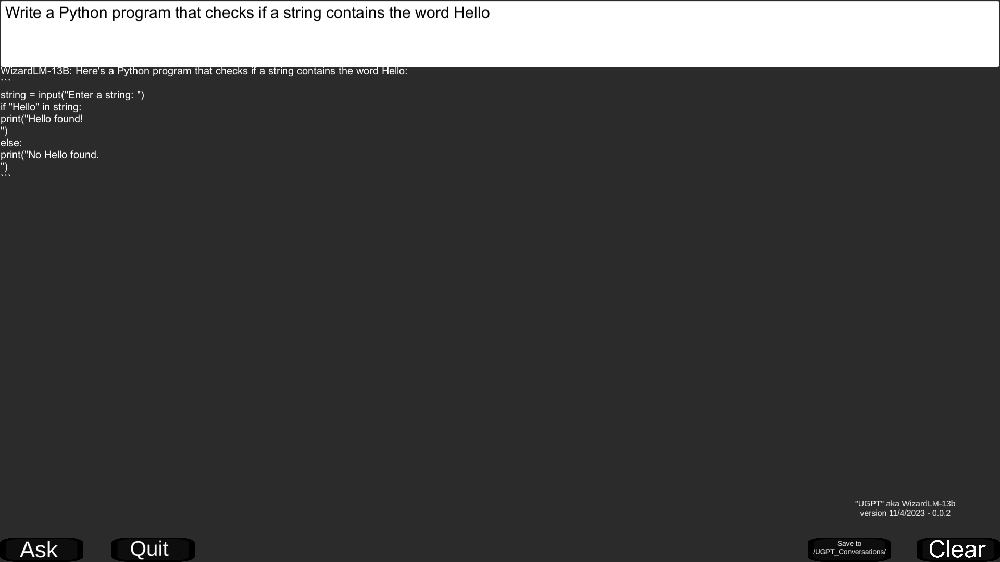
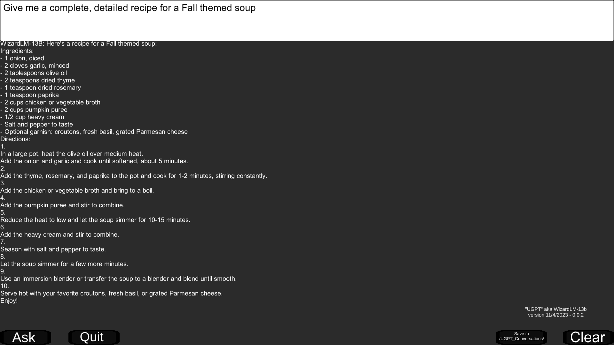
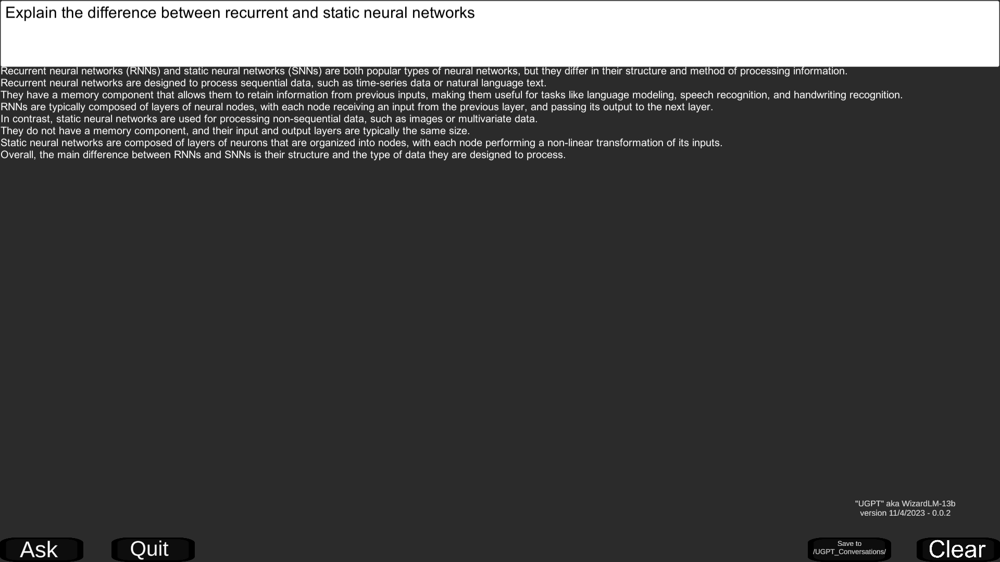

# wizardLMUnity
UGPT with WizardLM-13B in Unity

# Info  
This repo offers a free download to try an offline local UGPT tool from the Unity asset store using WizardLM-13B (7B model can also be made available). 

Unity store tool:  
https://assetstore.unity.com/packages/add-ons/machinelearning/ugpt-stand-alone-implementation-of-chatgpt-254790

WizardLM white paper:  
https://arxiv.org/pdf/2304.12244.pdf

HuggingFace models:  
[WizardLM-13B-Uncensored-GGML](https://huggingface.co/TheBloke/WizardLM-13B-Uncensored-GGML)  
[WizardLM-7B-V1.0-Uncensored-GGML](https://huggingface.co/TheBloke/WizardLM-7B-V1.0-Uncensored-GGML)  

# To Run  
Download and unzip the Unity build: [wizardLMUnity Google Drive link](https://drive.google.com/file/d/1nsfrpvqyiifhIWQ2tc8BH_mZr-3iw6s2/view?usp=sharing)  
Launch the Unity application from inside the unzipped folder by clicking on the executable file named WizardLM.exe. 

  
  
  

# Tips
The 13B model especially can be slow to finish generating responses.  
You can save the model output by clicking the Save button, which will create a new folder called UGPT_Conversations if it does not already exist, and it will save to both JSON and text format.  
Saved text files have the filename format: ugpt_conversation_<month>_<day>_<year>_<hour>_<minute>_<am/pm>
You can open the folder containing saved conversation files by clicking the Open button.

# To-do  
Add a runtime option to select either 13B or 7B model, or load a custom model if it can work with this framework.  
Add optional capture for saving user's questions as well as the model's reply.  
Improve UI quality.  
